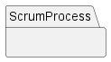

# 📕Documentation

## 🌀 Project's Package Model

### 📲 Modules
* **[ScrumProcess](./scrumprocess/)** :Subontology addresses the events that occur in a project that adopts Scrum, such as the Scrum ceremonies

